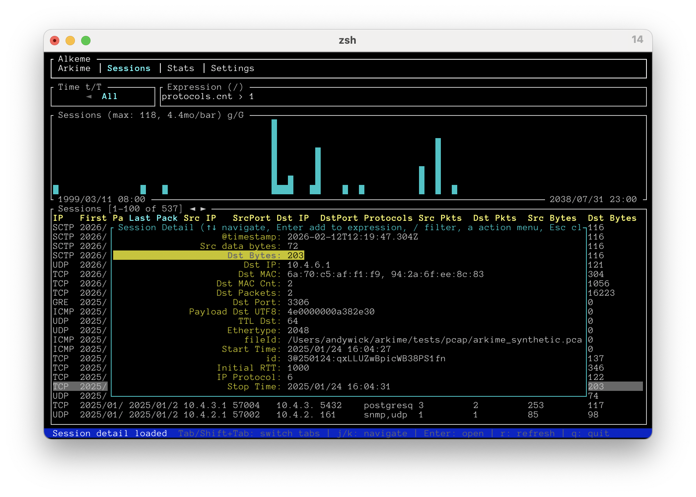
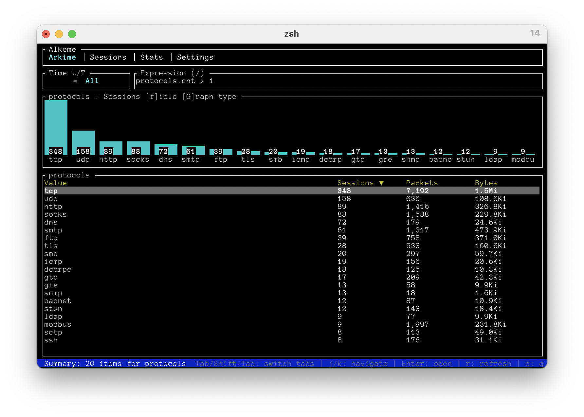
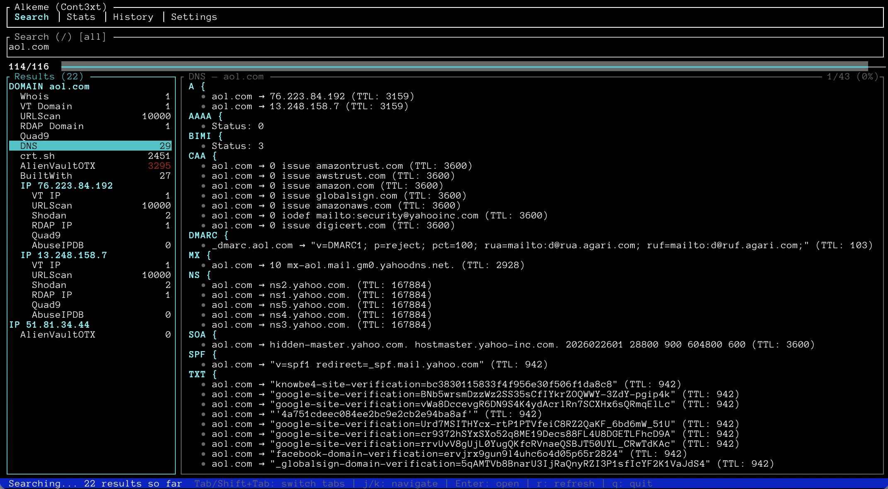
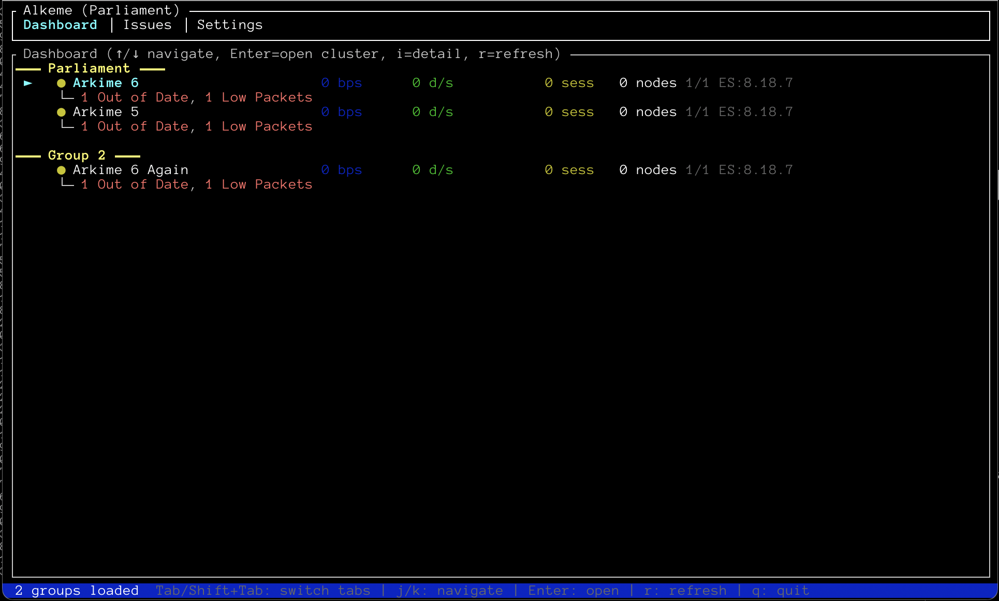

# Alkeme

A terminal user interface (TUI) for the [Arkime](https://arkime.com) ecosystem, built with Rust and [ratatui](https://github.com/ratatui/ratatui).

Alkeme auto-detects the Arkime application (Viewer, Cont3xt, WISE, Parliament) and provides a tailored interface for each. Currently supports Viewer (full packet capture session browsing), Cont3xt (integration search with card-based results), Parliament (cluster monitoring dashboard with health stats and issue tracking), and WISE (source/type statistics and lookups).

This project was entirely created by Claude — code, architecture, documentation, and even this README. The only exception is the screenshots, because sadly no one has given me eyes yet.


## Table of Contents

- [Screenshots](#screenshots)
- [Features](#features)
- [Requirements](#requirements)
- [Installation](#installation)
- [Usage](#usage)
- [Keybindings](#keybindings)
- [License](#license)

## Screenshots

### Sessions Tab
Browse and search network sessions with sortable columns, time range selection, and histograms.



### Arkime Tab
Select any field to see top values with a bar chart and sortable table showing sessions, packets, and bytes.



### Cont3xt Search
Search indicators across integrations with streaming results, card-based rendering, and overview panels.



### Parliament Dashboard
Monitor all your Arkime clusters at a glance with health status, throughput, and issue tracking. Easily jump to (c)ont3xt, (w)ise, or any viewer by pressing Enter on a cluster — and `q` takes you right back.



## Features

### Viewer
- **Session browsing** — paginated session list with configurable columns and sort order
- **Column layout** — press `c` to toggle/reorder columns with type-to-filter search, save/load/delete named layouts via the Arkime API
- **Views** — press `v` to select, create, or delete server-side views that filter sessions; shared views shown with indicator; active view displayed in title bar
- **Summary tab** — select any field to see top values with bar chart and table showing sessions, packets, and bytes; cycle metrics and sort columns
- **Session detail** — drill into any session to view all captured fields with friendly names
- **Expression builder** — select any field in session detail to add it to the search expression (AND/AND NOT/OR/OR NOT); array fields show a value picker
- **Expression search** — filter sessions using Arkime's expression syntax with full cursor support (e.g. `ip.src == 10.0.0.1 && protocols == tls`)
- **Time range selection** — quickly switch between preset time ranges (15 min to all time)
- **Histograms** — toggle session/packet/byte graphs rendered with block characters
- **Session actions** — download PCAP, add/remove tags for single or all sessions; all-session PCAP/CSV supports visible vs matching scope
- **Export** — export all matching or visible sessions as CSV
- **Session detail filter** — press `/` to live-filter fields by name
- **Packet hex dump** — press `p` to view packet contents as hex in a two-column overlay (source/destination) with timestamps, TCP flags, color-coded display, and hex offsets; `r` toggles raw frames, `l` cycles line number format; animated loading indicator for large sessions
- **Stats tab** — view capture stats, DB nodes, and DB indices with sortable tables, filtering, detail view, and configurable columns; press `c` to toggle/reorder columns, save/load named layouts via the shareable API
- **Index operations** — delete, force merge, close, or open DB indices with confirmation dialogs
- **Node operations** — toggle node or IP exclusion from DB Nodes list or detail view
- **Files tab** — browse PCAP files with sortable, filterable, paginated table; configurable columns with save/load layouts via shareable API; Enter opens detail overlay with all fields

### Cont3xt
- **Integration search** — search indicators (IPs, domains, emails, hashes) across all configured integrations
- **Streaming results** — results appear incrementally as integrations respond; tree hierarchy shows parent-child indicator chains (e.g., URL → DOMAIN → IP); progress gauge shows sent/total count during search
- **Card-based rendering** — integration results displayed using server-defined card templates with proper field types (string, date, url, table, array, JSON, DNS records)
- **Table alignment** — card tables have properly aligned columns with horizontal scroll support
- **Raw JSON toggle** — press `R` to switch between card view and raw JSON
- **Integration filter** — press `i` to toggle integrations on/off with bulk actions (all/none/invert); disabled integrations sent as `doIntegrations` to the search API
- **Views** — press `Shift+I` or `v` to select a saved integration view; loading a view applies its integration settings; manually toggling integrations clears the active view; search bar shows "all", view name, or "custom"
- **Link groups** — press `l` to browse applicable link groups for the selected indicator; Enter opens the link URL in your browser
- **Indicator navigation** — `Shift+↑`/`Shift+↓` jumps between top-level indicators in the results tree
- **Detail filter** — press `/` in the detail panel to filter fields by text; section headers shown only when matching data exists
- **Card definition** — press `C` in detail to view card/overview definition; `s` to save to `/tmp/alkeme-card.txt`
- **Overviews** — indicator headers are selectable in the results tree and show a cross-integration overview in the detail pane; press `o` to choose from available overviews; `R` toggles debug mode showing all fields including missing data
- **History** — browse search audit history with sortable, filterable table; server-side pagination with `←`/`→`; `Enter` re-runs a past search; `d` deletes an entry
- **JSON export** — press `J` to save all search results as a combined JSON file with a filename prompt
- **JSON import** — `--cont3xt-read-json` loads previously saved results for browsing without re-running searches; search bar shows `[file: ...]` indicator; cleared on new search
- **Search tags** — press `t` to set comma-separated tags sent with search queries; also settable via `--cont3xt-tags` CLI option; shown in the search bar title
- **Settings** — manage integration views with CRUD operations; set view/edit roles with a role selector; configure per-integration settings (API keys, passwords, URLs) with disable/enable toggle; 4 sub-tabs (Views, Integrations, Overviews, LinkGroups)

### Parliament
- **Cluster dashboard** — groups displayed with clusters showing health status (●green/●yellow/●red), bytes/sec, drops/sec, active sessions, node counts, ES info, and inline issues
- **Issue tracking** — dedicated Issues tab with filterable, sortable table of all cluster issues with severity, timestamps, node info
- **Cluster detail** — press `i` for a detailed overlay showing full stats and all issues for a cluster
- **Viewer switch** — press `Enter` on a cluster to connect to it and switch to Viewer for live session browsing
- **Cont3xt/WISE switch** — press `c` or `w` to switch to Cont3xt or WISE using URLs from Parliament settings
- **Auto-refresh** — dashboard and issues auto-refresh every 30 seconds

### WISE
- **Source stats** — view statistics for all WISE sources (requests, cache hits/misses, avg response time, item count)
- **Type stats** — view statistics for all WISE types (requests, found, cache stats)
- **Query** — look up values by type (ip, domain, email, etc.) across all or specific sources
- **Auto-refresh** — stats auto-refresh every 30 seconds

### Common
- **Multi-app detection** — auto-detects Viewer, Cont3xt, WISE, or Parliament via `/api/appversion`
- **Authentication** — supports no-auth, HTTP Basic, HTTP Digest, form-based (cookie), web (HTML form parsing with redirect support), and Okta SSO (Identity Engine + classic, with MFA push/TOTP) authentication
- **Credential prompting** — prompts for username/password if not provided; `--user username` (no colon) prompts for password only
- **User permissions** — respects `removeEnabled` from the Arkime user profile
- **HTTP debug log** — press `D` to view all HTTP requests with timing, status, and response bodies; select entries with ↑/↓ and press Enter to expand full request/response details with pretty-printed JSON
- **Expression input** — full cursor support with horizontal scrolling when text exceeds box width; `Shift+←`/`Shift+→` for word-at-a-time jumping
- **Sort column indicators** — active sort column highlighted in Cyan with ▲/▼ arrow; other sortable columns shown in Yellow
- **Keyboard-driven** — fully navigable with keyboard shortcuts

## Requirements

- A running [Arkime](https://arkime.com) instance (Viewer, Cont3xt, WISE, or Parliament)
- [Arkime 6](https://arkime.com) or later required

## Installation

### Pre-built binaries

Download the latest binary for your platform from the [Releases page](https://github.com/arkime/alkeme/releases/latest).

After downloading:
```bash
chmod a+x alkeme-*
```

On macOS, you also need to remove the quarantine attribute:
```bash
xattr -d com.apple.quarantine alkeme-macos-arm64
```

### Build from source

Requires [Rust](https://www.rust-lang.org/tools/install) (edition 2024).

```bash
git clone https://github.com/arkime/alkeme.git
cd alkeme
cargo build --release
```

The binary will be at `target/release/alkeme`.

## Usage

```bash
# Connect to a local Arkime viewer (default: http://localhost:8005)
alkeme

# Connect to a specific URL
alkeme http://viewer.example.com:8005

# With digest authentication (inline credentials)
alkeme http://viewer.example.com:8005 --auth digest --user admin:password

# With form-based authentication
alkeme http://viewer.example.com:8005 --auth form --user admin:password

# With web authentication (parses HTML login forms, supports SSO redirects)
alkeme http://viewer.example.com:8005 --auth web --user admin:password

# With Okta SSO authentication (supports Identity Engine + classic, with MFA)
alkeme http://viewer.example.com:8005 --auth okta --user admin:password

# With Okta SSO (prompts using Okta's configured labels)
alkeme http://viewer.example.com:8005 --auth okta

# Persist cookies to avoid re-login (encrypted, prompts for jar password)
alkeme http://viewer.example.com:8005 --auth okta --jar cookies.json

# Persist cookies with password from a command (e.g. password manager)
alkeme http://viewer.example.com:8005 --auth okta --jar cookies.json --jar-password '|pass show mykey'

# Full example: Okta auth + password manager for both login and cookie jar
alkeme http://localhost:8123/arkime/ --auth okta --user admin \
  --password '|lpass show --password okta-password' \
  --jar ~/alkeme.jar --jar-password '|lpass show --password jar-password'

# With basic authentication (prompts for credentials)
alkeme http://viewer.example.com:8005 --auth basic

# Skip app detection and force a specific application
alkeme http://cont3xt.example.com --auth form --user admin:password --app cont3xt

# Load previously saved Cont3xt results from a JSON file
alkeme http://cont3xt.example.com --auth form --user admin:password --cont3xt-read-json results.json
```

### Options

| Option | Description |
|---|---|
| `<URL>` | Arkime URL (default: `http://localhost:8005`) |
| `--app <APP>` | Force application: `viewer`, `cont3xt`, `wise`, or `parliament` (skips `/api/appversion` detection) |
| `--auth <MODE>` | Authentication mode: `none`, `basic`, `digest`*, `form`, `web`, or `okta` |
| `--cont3xt-read-json <FILE>` | Load Cont3xt results from a saved JSON file without running a search |
| `--cont3xt-save-json <FILE>` | Run Cont3xt search and save results as JSON (requires `--search` or `--cont3xt-search`) |
| `--cont3xt-search <EXPR>` | Search indicator for Cont3xt only |
| `--cont3xt-tags <TAGS>` | Comma-separated tags to include with Cont3xt searches |
| `--cont3xt-view <ID>` | Select a Cont3xt integration view by ID or name |
| `--jar <FILE>` | Encrypted cookie jar file — persist session cookies and username between runs to avoid re-login. Prompts for a jar password each run. (File created with owner-only permissions) |
| `--jar-password <PASS>` | Cookie jar password. If prefixed with `\|`, runs the rest as a command and uses the first line of output |
| `--password <PASS>` | Authentication password. If prefixed with `\|`, runs the rest as a command and uses the first line of output. Overrides the password portion of `--user` |
| `--search <EXPR>` | Default search expression (viewer and cont3xt); auto-submits in cont3xt |
| `--user <USER:PASS>` | Credentials in `user:pass` format (prompts if omitted with `--auth`); `user` without colon prompts for password only |
| `--viewer-search <EXPR>` | Search expression for Viewer only |
| `--viewer-time-range <RANGE>` | Default time range for Viewer (`15m`, `30m`, `1h`, `6h`, `24h`, `1w`, `2w`, `1M`, `All`, `-1`, or `{num}h/w/m` e.g. `72h`, `2w`, `3m`). Custom values are added to the time range menu for the session |

## Keybindings

### Viewer

| Key | Action |
|---|---|
| `Tab` / `Shift+Tab` | Switch tabs |
| `j` / `k` / `↑` / `↓` | Navigate sessions |
| `Shift+↑` / `Shift+↓` | Page up / down in list or detail |
| `←` / `→` | Previous / next page (sessions); jump to top / bottom (detail/stats/arkime); move cursor (expression) |
| `Shift+←` / `Shift+→` | First / last page; word jump in expression input |
| `Home` / `End` | First page; in expression input, move cursor to start / end |
| `PgUp` / `PgDn` | Page up / down in detail or packet view |
| `Enter` | Open session detail; in detail or summary, add field to expression |
| `Esc` | Close overlay / cancel search |
| `r` | Refresh |
| `/` or `E` | Search expression (`Enter` to apply, `Esc` to cancel); in session detail, live-filter fields |
| `t` / `T` | Cycle time range forward / backward |
| `s` | Next sort column (Value/Sessions/Packets/Bytes on summary tab) |
| `S` | Toggle sort direction (asc / desc) |
| `g` | Cycle graph size: Off → Small → Large → Off |
| `G` | Cycle graph type: Sessions → Packets → Bytes; cycle bar chart metric (summary tab) |
| `a` | Session actions (download PCAP, add/remove tags) |
| `A` | All sessions actions (download PCAP, export CSV, add/remove tags) with visible/matching selector |
| `f` | Open field selector (summary tab) |
| `1` / `2` / `3` | Switch stats sub-tab (Capture / DB Nodes / DB Indices) |
| `p` | View packet hex dump (sessions list or detail) |
| `c` | Open columns & layouts menu |
| `v` | Open views menu (select/create/delete views) |
| `d` | Delete index (DB Indices) |
| `f` | Force merge index (DB Indices) |
| `C` | Close open index (DB Indices) |
| `O` | Open closed index (DB Indices) |
| `e` | Toggle exclude/include node (DB Nodes, list or detail) |
| `x` | Toggle exclude/include IP (DB Nodes, list or detail) |
| `D` | Show HTTP debug log (request timing, status codes) |
| `h` / `?` | Show context-sensitive help overlay |
| `q` | Quit |

### Cont3xt

| Key | Action |
|---|---|
| `Tab` / `Shift+Tab` | Switch tabs |
| `j` / `k` / `↑` / `↓` | Navigate results list or scroll detail |
| `Shift+↑` / `Shift+↓` | Page up / down; jump to next/prev indicator (results) |
| `PgUp` / `PgDn` | Page up / down (detail) |
| `Shift+←` / `Shift+→` | Fast scroll detail left / right; word jump in expression |
| `Home` | Jump to top, reset horizontal scroll |
| `End` | Jump to bottom |
| `Enter` | Open detail panel (results); re-run search (History); close detail uses `Esc` |
| `Esc` | Return to results from detail; close popups |
| `/` | Edit search indicator (results); filter detail fields (detail) |
| `E` | Edit search indicator |
| `R` | Toggle raw JSON / card view; debug mode for overview |
| `C` | Card/overview definition popup (detail); `s` saves to `/tmp/alkeme-card.txt` |
| `o` | Select overview (when on indicator header) |
| `i` | Integration filter (toggle on/off, `a`:all, `n`:none, `!`:invert, `/`:filter) |
| `v` / `Shift+I` | Open views popup (select/create/delete integration views) |
| `l` | Link groups for selected indicator (Enter opens in browser) |
| `r` | Re-run search; refresh (Stats/History) |
| `s` / `S` | Next sort column / toggle direction (Stats/History) |
| `d` | Delete history entry (History) |
| `J` | Save all results as JSON (prompts for filename) |
| `t` | Edit search tags (comma-separated, sent with queries) |
| `1` / `2` / `3` / `4` | Switch Settings sub-tab (Views/Integrations/Overviews/LinkGroups) |
| `n` | New view (Settings Views) |
| `e` / `Enter` | Edit view (Settings Views); open integration editor (Settings Integrations) |
| `d` / `x` | Delete view (Settings Views); toggle disabled (Settings Integrations) |
| `p` | Toggle password visibility (Integration editor) |
| `Ctrl+S` | Save (view editor / integration settings) |
| `←` / `→` | Previous / next page (History); jump to top/bottom (results); scroll detail |
| `D` | HTTP debug log (↑/↓ navigate, Enter expand, Esc collapse) |
| `h` / `?` | Show help |
| `q` | Quit |

### Parliament

| Key | Action |
|---|---|
| `Tab` / `Shift+Tab` | Switch tabs (Dashboard / Issues / Settings) |
| `j` / `k` / `↑` / `↓` | Navigate clusters (Dashboard) or issues (Issues) |
| `Shift+↑` / `Shift+↓` | Page up / down (Issues) |
| `Home` / `End` | Jump to top / bottom (Issues) |
| `Enter` | Open cluster in Viewer (Dashboard) |
| `i` | Cluster detail overlay (Dashboard) |
| `c` | Open Cont3xt (if configured in Parliament settings) |
| `w` | Open WISE (if configured in Parliament settings) |
| `Ctrl+p` | Return to Parliament (from Viewer, Cont3xt, or WISE) |
| `/` or `E` | Filter issues (Issues tab) |
| `s` | Next sort column (Issues) |
| `S` | Toggle sort direction (Issues) |
| `r` | Refresh |
| `D` | HTTP debug log |
| `h` / `?` | Show help |
| `q` | Quit |

### WISE

| Key | Action |
|---|---|
| `Tab` / `Shift+Tab` | Switch tabs (Stats / Query / Settings) |
| `1` / `2` | Sources / Types sub-tab (Stats) |
| `j` / `k` / `↑` / `↓` | Navigate rows |
| `Shift+↑` / `Shift+↓` | Page up / down |
| `Home` / `End` | Jump to top / bottom |
| `/` or `E` | Filter stats or edit query value |
| `s` | Cycle source (Query) |
| `t` | Cycle type (Query) |
| `Enter` | Run query (Query) |
| `r` | Refresh (Stats) |
| `Ctrl+p` | Return to Parliament |
| `D` | HTTP debug log |
| `h` / `?` | Show help |
| `q` | Quit |

## License

Apache License 2.0 — see [LICENSE](LICENSE) for details.
